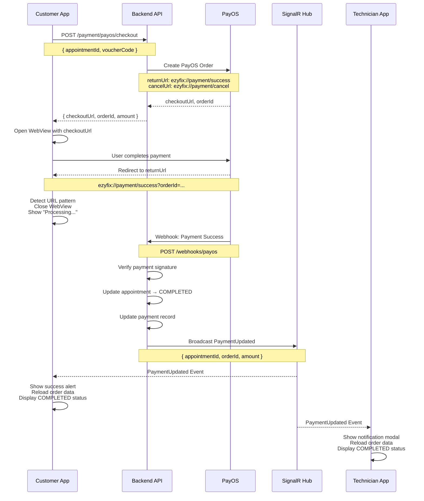

# Payment Redirect URLs - Backend Configuration Guide

## 📋 Overview
Document này mô tả chi tiết các redirect URLs cần thiết cho PayOS payment integration, để backend team có thể configure đúng.

---

## 🔗 Required Redirect URLs

### ✅ Success Redirect URL (Thanh toán thành công)

#### Option 1: Deep Link (Recommended for Production)
```
ezyfix://payment/success?orderId={ORDER_ID}&appointmentId={APPOINTMENT_ID}&amount={AMOUNT}
```

**Ưu điểm:**
- Trở về app ngay lập tức
- Không cần mở browser
- UX tốt nhất

**Backend Configuration:**
```json
{
  "successUrl": "ezyfix://payment/success",
  "returnUrl": "ezyfix://payment/success"
}
```

#### Option 2: HTTPS URL (Development/Testing)
```
https://payment.ezyfix.com/success?orderId={ORDER_ID}&appointmentId={APPOINTMENT_ID}&amount={AMOUNT}
```

**Backend Configuration:**
```json
{
  "successUrl": "https://payment.ezyfix.com/success",
  "returnUrl": "https://payment.ezyfix.com/success"
}
```

#### Option 3: Current Pattern Detection (Fallback)
App hiện đang check pattern trong URL:
```typescript
if (url.includes('/payment/success') || url.includes('status=success')) {
  // Success handling
}
```

Bất kỳ URL nào chứa `/payment/success` hoặc `status=success` đều được xem là thành công.

---

### ❌ Failure/Cancel Redirect URL (Thanh toán thất bại/hủy)

#### Option 1: Deep Link (Recommended for Production)
```
ezyfix://payment/cancel?orderId={ORDER_ID}&appointmentId={APPOINTMENT_ID}&reason={REASON}
```

**Backend Configuration:**
```json
{
  "cancelUrl": "ezyfix://payment/cancel",
  "failureUrl": "ezyfix://payment/cancel"
}
```

#### Option 2: HTTPS URL (Development/Testing)
```
https://payment.ezyfix.com/cancel?orderId={ORDER_ID}&appointmentId={APPOINTMENT_ID}&reason={REASON}
```

**Backend Configuration:**
```json
{
  "cancelUrl": "https://payment.ezyfix.com/cancel",
  "failureUrl": "https://payment.ezyfix.com/cancel"
}
```

#### Option 3: Current Pattern Detection (Fallback)
App hiện đang check pattern trong URL:
```typescript
if (url.includes('/payment/cancel') || url.includes('status=cancel')) {
  // Cancel handling
}
```

Bất kỳ URL nào chứa `/payment/cancel` hoặc `status=cancel` đều được xem là đã hủy.

---

## 🎯 Recommended Configuration (Production)

### PayOS Checkout Request Body
```json
{
  "orderCode": "ORDER_12345",
  "amount": 500000,
  "description": "Thanh toán dịch vụ sửa chữa - Appointment #123",
  "buyerName": "Nguyễn Văn A",
  "buyerEmail": "customer@example.com",
  "buyerPhone": "0901234567",
  "buyerAddress": "123 Đường ABC, Quận 1, TP.HCM",
  "items": [
    {
      "name": "Sửa chữa điện nước",
      "quantity": 1,
      "price": 500000
    }
  ],
  "returnUrl": "ezyfix://payment/success",
  "cancelUrl": "ezyfix://payment/cancel"
}
```

### Alternative: Use Web URLs for WebView
Nếu deep link không hoạt động trong WebView, dùng web URLs:
```json
{
  "returnUrl": "https://payment.ezyfix.com/success?appointmentId={APPOINTMENT_ID}",
  "cancelUrl": "https://payment.ezyfix.com/cancel?appointmentId={APPOINTMENT_ID}"
}
```

---

## 📱 App-Side URL Detection Logic

### Current Implementation (app/customer/order-tracking.tsx)
```typescript
const handleWebViewNavigationStateChange = (navState: any) => {
  const { url } = navState;
  
  // SUCCESS: Check pattern trong URL
  if (url.includes('/payment/success') || url.includes('status=success')) {
    console.log('✅ Payment success detected from URL');
    
    // Close WebView
    setShowPaymentModal(false);
    
    // Show processing message
    Alert.alert(
      'Đang xử lý thanh toán',
      'Chúng tôi đang xác nhận thanh toán của bạn. Vui lòng đợi trong giây lát.',
      [{ text: 'OK' }]
    );
    
    // Wait for SignalR confirmation (real source of truth)
    setTimeout(() => {
      loadOrderDetail();
    }, 2000);
  }
  
  // CANCEL/FAILURE: Check pattern trong URL
  if (url.includes('/payment/cancel') || url.includes('status=cancel')) {
    console.log('⚠️ Payment cancelled');
    
    // Close WebView
    setShowPaymentModal(false);
    
    // Show cancellation message
    Alert.alert(
      'Thanh toán đã hủy',
      'Bạn đã hủy thanh toán. Bạn có thể thử lại bất cứ lúc nào.',
      [{ text: 'OK' }]
    );
  }
};
```

### Why Pattern Detection?
- **Flexible**: Hoạt động với bất kỳ domain nào
- **Reliable**: Không bị ảnh hưởng bởi query parameters
- **Simple**: Dễ maintain và debug

---

## 🔐 Security Considerations

### ⚠️ IMPORTANT: Don't Trust URL Alone!
WebView redirect URL chỉ là **visual feedback** cho user, **KHÔNG** nên dùng làm nguồn xác thực chính.

### Real Payment Confirmation Flow:
1. ✅ **URL Detection** → Close WebView, show "Processing..." message
2. ✅ **SignalR Event** → Real confirmation from backend (source of truth)
3. ✅ **Backend Validation** → Verify payment with PayOS API
4. ✅ **Broadcast PaymentUpdated** → Notify app via SignalR
5. ✅ **App Updates UI** → Show success and update status to COMPLETED

### Backend Must:
1. Verify payment status with PayOS API (not just trust redirect)
2. Update appointment status in database
3. Broadcast SignalR `PaymentUpdated` event
4. Return payment confirmation to app

---

## 🧪 Testing URLs

### Development Environment
```
Success: http://localhost:3000/payment/success?orderId=TEST123
Cancel:  http://localhost:3000/payment/cancel?orderId=TEST123
```

### Staging Environment
```
Success: https://staging-payment.ezyfix.com/success?orderId={ORDER_ID}
Cancel:  https://staging-payment.ezyfix.com/cancel?orderId={ORDER_ID}
```

### Production Environment
```
Success: ezyfix://payment/success?orderId={ORDER_ID}&appointmentId={APPOINTMENT_ID}
Cancel:  ezyfix://payment/cancel?orderId={ORDER_ID}&appointmentId={APPOINTMENT_ID}
```

---

## 📋 Backend Checklist

### PayOS Integration Setup:
- [ ] Register PayOS merchant account
- [ ] Get API credentials (Client ID, API Key, Checksum Key)
- [ ] Configure webhook URL for payment notifications
- [ ] Set returnUrl (success redirect)
- [ ] Set cancelUrl (failure/cancel redirect)

### API Endpoint:
- [ ] POST /api/v1/payment/payos/checkout
  - Accept: appointmentId, voucherCode?, invoiceRequested?
  - Return: checkoutUrl, orderId, amount
  - Set returnUrl = "ezyfix://payment/success" hoặc "https://payment.ezyfix.com/success"
  - Set cancelUrl = "ezyfix://payment/cancel" hoặc "https://payment.ezyfix.com/cancel"

### Payment Webhook Handler:
- [ ] Receive PayOS webhook notification
- [ ] Verify payment signature/checksum
- [ ] Update appointment status to COMPLETED
- [ ] Update payment record in database
- [ ] Broadcast SignalR PaymentUpdated event:
  ```json
  {
    "appointmentId": "abc-123",
    "orderId": "ORDER_12345",
    "amount": 500000,
    "status": "COMPLETED",
    "timestamp": "2025-10-30T10:30:00Z"
  }
  ```

### SignalR Hub:
- [ ] Hub endpoint: /hubs/payments
- [ ] JWT authentication enabled
- [ ] PaymentUpdated event broadcasting
- [ ] Filter by appointmentId ownership

---

## 🎬 Complete Payment Flow



---

## 🌐 Deep Link Configuration (iOS/Android)

### React Native / Expo Configuration

#### app.json
```json
{
  "expo": {
    "scheme": "ezyfix",
    "ios": {
      "bundleIdentifier": "com.ezyfix.app",
      "associatedDomains": ["applinks:ezyfix.com"]
    },
    "android": {
      "package": "com.ezyfix.app",
      "intentFilters": [
        {
          "action": "VIEW",
          "autoVerify": true,
          "data": [
            {
              "scheme": "ezyfix",
              "host": "payment"
            }
          ],
          "category": ["BROWSABLE", "DEFAULT"]
        }
      ]
    }
  }
}
```

### Testing Deep Links

#### iOS Simulator:
```bash
xcrun simctl openurl booted "ezyfix://payment/success?orderId=TEST123"
```

#### Android Emulator:
```bash
adb shell am start -W -a android.intent.action.VIEW -d "ezyfix://payment/success?orderId=TEST123" com.ezyfix.app
```

---

## 📞 Contact Backend Team

### Required Information to Provide:
1. **Success URL**: `ezyfix://payment/success` hoặc `https://payment.ezyfix.com/success`
2. **Cancel URL**: `ezyfix://payment/cancel` hoặc `https://payment.ezyfix.com/cancel`
3. **URL Pattern**: App detects `/payment/success` hoặc `status=success` for success
4. **URL Pattern**: App detects `/payment/cancel` hoặc `status=cancel` for cancel
5. **SignalR Event**: Backend must broadcast `PaymentUpdated` event after webhook confirmation

### Questions for Backend:
- [ ] Có support deep link `ezyfix://` không?
- [ ] Có cần dùng HTTPS URLs thay vì deep links?
- [ ] PayOS webhook endpoint URL là gì?
- [ ] SignalR hub có enabled JWT authentication không?
- [ ] Test environment URLs là gì?

---

## 🐛 Troubleshooting

### Issue: WebView không redirect
**Solution**: Kiểm tra PayOS có được config đúng returnUrl/cancelUrl không

### Issue: Deep link không hoạt động
**Solution**: Dùng HTTPS URLs thay vì deep links trong development

### Issue: App không nhận được confirmation
**Solution**: Check SignalR connection state và backend có broadcast event không

### Issue: Payment success nhưng status không update
**Solution**: Verify backend webhook handler có gọi SignalR broadcast không

---

## 📝 Summary

### Backend Team Cần Setup:

1. **PayOS Checkout API** (`/api/v1/payment/payos/checkout`):
   ```json
   {
     "returnUrl": "ezyfix://payment/success",
     "cancelUrl": "ezyfix://payment/cancel"
   }
   ```

2. **PayOS Webhook Handler**:
   - Verify payment với PayOS
   - Update appointment status → COMPLETED
   - Broadcast SignalR PaymentUpdated event

3. **SignalR Hub** (`/hubs/payments`):
   - Event: `PaymentUpdated`
   - Payload: `{ appointmentId, orderId, amount, status, timestamp }`

### App-Side Pattern Detection:
- ✅ Success: URL contains `/payment/success` OR `status=success`
- ❌ Cancel: URL contains `/payment/cancel` OR `status=cancel`
- 🔔 Real confirmation: SignalR `PaymentUpdated` event (source of truth)

---

**Document Version**: 1.0.0  
**Last Updated**: Current session  
**Status**: Ready for Backend Integration
