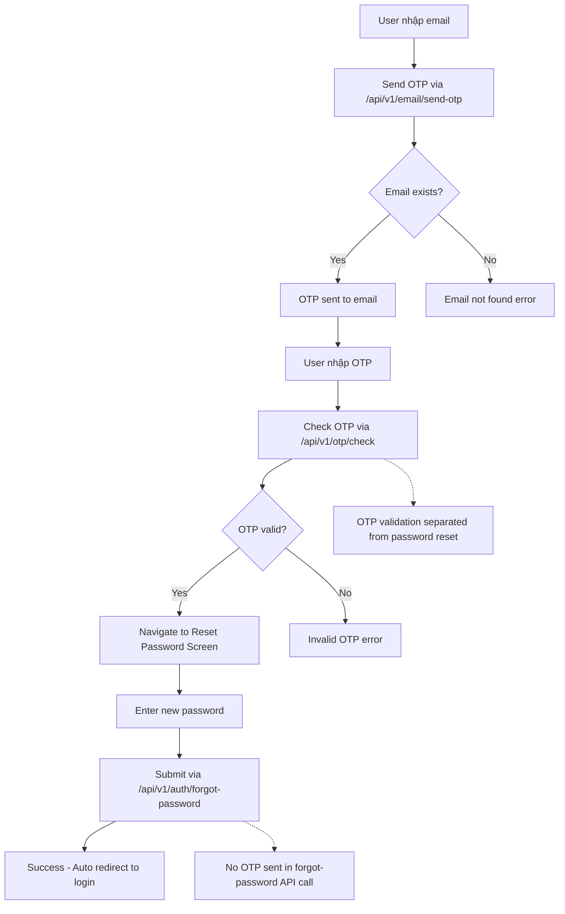

# 🔐 Authentication System

Hệ thống xác thực của EzyFix React Native App với JWT-based authentication và OTP verification.

## 🏗️ Kiến trúc tổng quan

```
┌─────────────────┐    ┌──────────────────┐    ┌─────────────────┐
│   Auth Screens  │────│  Auth Service    │────│   Backend API   │
│   • Login       │    │  (lib/api/auth)  │    │   (Railway)     │
│   • Register    │    │  • JWT handling  │    │   • JWT tokens  │
│   • OTP Verify  │    │  • Token storage │    │   • OTP system  │
│   • Forgot Pass │    │  • isVerify flow │    │   • Email API   │
└─────────────────┘    └──────────────────┘    └─────────────────┘
```

## 🔧 Core Authentication Service

### AuthService Class (`lib/api/auth.ts`)

**Key Features:**
- ✅ **Singleton pattern** for consistent state management
- ✅ **JWT token management** with automatic refresh
- ✅ **Secure storage** using AsyncStorage
- ✅ **isVerify field handling** from JWT payload
- ✅ **Professional error handling** and logging
- ✅ **OTP anti-spam protection** with React strict mode compatibility

**Main Methods:**
```typescript
export class AuthService {
  // Authentication
  login(loginData: LoginRequest): Promise<LoginResponse>
  register(registerData: RegisterRequest): Promise<RegisterResponse>
  logout(): Promise<void>
  
  // Token management
  getAccessToken(): Promise<string | null>
  refreshToken(): Promise<string>
  isAuthenticated(): Promise<boolean>
  
  // User data
  getUserData(): Promise<UserData | null>
  updateUserVerificationStatus(isVerify: boolean): Promise<void>
  
  // OTP verification
  sendEmailOtp(email: string, purpose: string): Promise<SendOtpResponse>
  verifyAccount(requestData: VerifyAccountRequest): Promise<VerifyAccountResponse>
  checkOtp(requestData: ValidateOtpRequest): Promise<ValidateOtpResponse>
  
  // Password management
  forgotPassword(requestData: ForgotPasswordRequest): Promise<ForgotPasswordResponse>
  changePassword(requestData: ChangePasswordRequest): Promise<void>
  
  // User type management
  setUserType(userType: 'customer' | 'technician'): Promise<void>
  getUserType(): Promise<'customer' | 'technician' | null>
}
```

### JWT Token Handling

**isVerify Field Resolution:**
```typescript
private decodeJWTPayload(token: string): any {
  try {
    const base64Url = token.split('.')[1];
    const base64 = base64Url.replace(/-/g, '+').replace(/_/g, '/');
    const jsonPayload = decodeURIComponent(
      atob(base64).split('').map(c => 
        '%' + ('00' + c.charCodeAt(0).toString(16)).slice(-2)
      ).join('')
    );
    return JSON.parse(jsonPayload);
  } catch (error) {
    return null;
  }
}
```

**Automatic Token Storage:**
- Access tokens stored securely in AsyncStorage
- Refresh tokens managed automatically
- User verification status extracted from JWT payload

## 📱 UI Components

### 🔑 LoginScreen (`components/LoginScreen.tsx`)
- **Email validation**: Định dạng email hợp lệ
- **Password validation**: Tối thiểu 6 ký tự
- **Professional error handling**: Inline messages, không popup
- **Loading states**: Spinner và disable buttons khi đang xử lý

```typescript
// Error handling example
const [error, setError] = useState('');

// ✅ Professional error display
{error && (
  <Text className="text-red-500 text-sm mb-4 text-center">
    {error}
  </Text>
)}
```

### 📝 RegisterScreen (`components/RegisterScreen.tsx`)
- **Complete user info**: firstName, lastName, email, password
- **OTP verification**: 2-step registration process
- **Email-only support**: Không sử dụng phone number
- **Professional animations**: Smooth transitions

### 🔄 ForgotPasswordScreen (`components/ForgotPasswordScreen.tsx`)
- **3-step process**:
  1. Nhập email → Send OTP via `/api/v1/email/send-otp`
  2. Nhập OTP → Check via `/api/v1/otp/check` ✨ **New endpoint**
  3. Đặt mật khẩu mới → Reset via `/api/v1/auth/forgot-password` (no OTP needed)
- **Email validation**: Chỉ accept email format
- **Separated OTP validation**: OTP được validate riêng, không gửi kèm reset password
- **Professional UI**: App color scheme (#609CEF), animations, success modals
- **Auto-submit OTP**: Tự động submit khi nhập đủ 6 số
- **Vietnamese error handling**: Comprehensive error messages in Vietnamese

### 🔢 OTPVerificationScreen (`components/OTPVerificationScreen.tsx`)
- **Reusable component**: Dùng cho cả registration và password reset
- **6-digit input**: Custom OTP input với auto-focus và auto-submit
- **Real-time validation**: Validate OTP ngay khi nhập đủ 6 số
- **Professional animations**: Slide, fade, và spring animations
- **Countdown timer**: 60-second countdown cho resend OTP
- **Purpose-based navigation**: Navigate khác nhau tùy theo purpose (registration/password-reset)

### 🔐 ResetPasswordScreen (`app/customer|technician/reset-password.tsx`)
- **Email-only parameter**: Chỉ nhận email từ navigation (không cần OTP)
- **Password validation**: Minimum 6 characters, confirm password matching
- **Modern UI**: LoginScreen-inspired design với app color scheme
- **Professional success modal**: Animated success feedback với auto-redirect
- **Error handling**: Chi tiết error messages bằng tiếng Việt
- **Consistent design**: Matching typography, spacing, và animations across app

## 🔧 Service Layer

### 📡 AuthService (`lib/api/auth.ts`)

```typescript
class AuthService {
  // Đăng nhập
  async login(credentials: LoginRequest): Promise<LoginResponse>
  
  // Đăng ký
  async register(userData: RegisterRequest): Promise<RegisterResponse>
  
  // Forgot Password Flow
  async sendForgotPasswordOTP(data: SendEmailOTPRequest): Promise<OTPResponse>
  async validateForgotPasswordOTP(data: ValidateOTPRequest): Promise<OTPResponse>
  async resetForgotPassword(data: ForgotPasswordResetRequest): Promise<PasswordResetResponse>
  
  // General OTP
  async sendOTP(data: SendEmailOTPRequest): Promise<OTPResponse>
  async verifyOTP(data: ValidateOTPRequest): Promise<OTPResponse>
}
```

### 🌐 BaseService (`lib/api/base.ts`)
- **HTTP client**: Axios-based với error handling
- **Request/Response interceptors**: Automatic token handling
- **Development logging**: Structured console logs
- **Error formatting**: Consistent error responses

## 🔀 Authentication Flows

### 1. 🔑 Login Flow
```mermaid
graph TD
    A[User nhập email/password] --> B[Validate input]
    B --> C[Call authService.login()]
    C --> D{API Response}
    D -->|Success| E[Lưu tokens vào AsyncStorage]
    D -->|Error| F[Hiển thị error message]
    E --> G[Navigate to Dashboard]
    F --> A
```

### 2. 📝 Registration Flow
```mermaid
graph TD
    A[User nhập thông tin] --> B[Validate input]
    B --> C[Call authService.register()]
    C --> D{Registration}
    D -->|Success| E[Send OTP]
    D -->|Error| F[Hiển thị error]
    E --> G[User nhập OTP]
    G --> H[Verify OTP]
    H --> I{OTP Valid?}
    I -->|Yes| J[Registration complete]
    I -->|No| K[Retry OTP]
```

### 3. 🔄 Forgot Password Flow (Updated)


**Key Changes:**
- ✅ **New OTP check endpoint**: `/api/v1/otp/check` cho forgot password flow ✨
- ✅ **Separated OTP validation**: OTP check riêng biệt từ password reset  
- ✅ **No OTP in reset API**: `/api/v1/auth/forgot-password` chỉ cần `{email, newPassword}`
- ✅ **Professional UI flow**: Consistent design across all screens
- ✅ **Better UX**: Auto-submit OTP, proper loading states, Vietnamese errors

## 🎨 UX Design Principles

### ✅ Professional Error Handling
- **Inline messages**: Không sử dụng alert/popup
- **Consistent styling**: Red text với proper spacing
- **Clear messaging**: Tiếng Việt dễ hiểu
- **Auto-clear errors**: Clear khi user retry

### 🎭 Loading States
```typescript
const [isLoading, setIsLoading] = useState(false);

// Professional loading UI
{isLoading ? (
  <ActivityIndicator size="small" color="#3B82F6" />
) : (
  <Text>Đăng nhập</Text>
)}
```

### 🎯 Input Validation
```typescript
// Email validation
const validateEmail = (email: string): boolean => {
  const emailRegex = /^[^\s@]+@[^\s@]+\.[^\s@]+$/;
  return emailRegex.test(email);
};

// Password validation  
const validatePassword = (password: string): boolean => {
  return password.length >= 6;
};
```

## 🔐 Security Features

### 🛡️ Token Management
- **AccessToken**: Lưu trong AsyncStorage
- **RefreshToken**: Auto-refresh khi expired
- **Secure Storage**: Encrypt sensitive data

### 🔒 Password Security
- **Minimum length**: 6 characters
- **No plain text storage**: Hash trước khi gửi API
- **Reset flow**: Secure OTP-based reset

## 📊 State Management

### 🗂️ Auth State
```typescript
// store/authStore.ts
interface AuthState {
  user: User | null;
  isAuthenticated: boolean;
  isLoading: boolean;
  error: string | null;
}
```

### 💾 Persistence
```typescript
// AsyncStorage keys
const STORAGE_KEYS = {
  ACCESS_TOKEN: 'access_token',
  REFRESH_TOKEN: 'refresh_token',
  USER_DATA: 'user_data'
};
```

## 🐛 Debugging

### 📝 Development Logs
```typescript
if (__DEV__) {
  console.group('🔐 Authentication Debug');
  console.log('📧 Email:', email);
  console.log('🔑 Password length:', password.length);
  console.log('📊 Response:', response);
  console.groupEnd();
}
```

### 🔍 Common Issues
1. **Email not found (404)**: Sử dụng email đã đăng ký
2. **Invalid credentials (401)**: Kiểm tra email/password
3. **OTP expired (400)**: Request OTP mới
4. **Network error (500)**: Kiểm tra API endpoint

## 📱 Platform Support

- ✅ **Android**: Full support
- ✅ **iOS**: Full support  
- ✅ **Web**: Expo web compatible
- ✅ **Email-only**: Không hỗ trợ phone auth

---

## 🚀 Getting Started

1. Import AuthService trong component
2. Setup proper error handling
3. Implement loading states
4. Follow UX guidelines
5. Test với real API endpoints

```typescript
import { authService } from '../lib/api/auth';

// Usage example
const handleLogin = async () => {
  try {
    setIsLoading(true);
    const response = await authService.login({ email, password });
    // Handle success
  } catch (error) {
    setError(error.message);
  } finally {
    setIsLoading(false);
  }
};
```