# 🔐 Authentication System

Hệ thống xác thực của EzyFix React Native App.

## 🏗️ Kiến trúc tổng quan

```
┌─────────────────┐    ┌──────────────────┐    ┌─────────────────┐
│   Login Screen  │────│  Auth Service    │────│   Backend API   │
│   Register      │    │  (lib/api/auth)  │    │   (Railway)     │
│   Forgot Pass   │    │                  │    │                 │
└─────────────────┘    └──────────────────┘    └─────────────────┘
```

## 📱 UI Components

### 🔑 LoginScreen (`components/LoginScreen.tsx`)
- **Email validation**: Định dạng email hợp lệ
- **Password validation**: Tối thiểu 6 ký tự
- **Professional error handling**: Inline messages, không popup
- **Loading states**: Spinner và disable buttons khi đang xử lý

```typescript
// Error handling example
const [error, setError] = useState('');

// ✅ Professional error display
{error && (
  <Text className="text-red-500 text-sm mb-4 text-center">
    {error}
  </Text>
)}
```

### 📝 RegisterScreen (`components/RegisterScreen.tsx`)
- **Complete user info**: firstName, lastName, email, password
- **OTP verification**: 2-step registration process
- **Email-only support**: Không sử dụng phone number
- **Professional animations**: Smooth transitions

### 🔄 ForgotPasswordScreen (`components/ForgotPasswordScreen.tsx`)
- **3-step process**:
  1. Nhập email → Send OTP
  2. Nhập OTP → Verify
  3. Đặt mật khẩu mới → Reset
- **Email validation**: Chỉ accept email format
- **OTP input**: 6-digit custom input với auto-focus
- **Success feedback**: Professional success messages

## 🔧 Service Layer

### 📡 AuthService (`lib/api/auth.ts`)

```typescript
class AuthService {
  // Đăng nhập
  async login(credentials: LoginRequest): Promise<LoginResponse>
  
  // Đăng ký
  async register(userData: RegisterRequest): Promise<RegisterResponse>
  
  // Forgot Password Flow
  async sendForgotPasswordOTP(data: SendEmailOTPRequest): Promise<OTPResponse>
  async validateForgotPasswordOTP(data: ValidateOTPRequest): Promise<OTPResponse>
  async resetForgotPassword(data: ForgotPasswordResetRequest): Promise<PasswordResetResponse>
  
  // General OTP
  async sendOTP(data: SendEmailOTPRequest): Promise<OTPResponse>
  async verifyOTP(data: ValidateOTPRequest): Promise<OTPResponse>
}
```

### 🌐 BaseService (`lib/api/base.ts`)
- **HTTP client**: Axios-based với error handling
- **Request/Response interceptors**: Automatic token handling
- **Development logging**: Structured console logs
- **Error formatting**: Consistent error responses

## 🔀 Authentication Flows

### 1. 🔑 Login Flow
```mermaid
graph TD
    A[User nhập email/password] --> B[Validate input]
    B --> C[Call authService.login()]
    C --> D{API Response}
    D -->|Success| E[Lưu tokens vào AsyncStorage]
    D -->|Error| F[Hiển thị error message]
    E --> G[Navigate to Dashboard]
    F --> A
```

### 2. 📝 Registration Flow
```mermaid
graph TD
    A[User nhập thông tin] --> B[Validate input]
    B --> C[Call authService.register()]
    C --> D{Registration}
    D -->|Success| E[Send OTP]
    D -->|Error| F[Hiển thị error]
    E --> G[User nhập OTP]
    G --> H[Verify OTP]
    H --> I{OTP Valid?}
    I -->|Yes| J[Registration complete]
    I -->|No| K[Retry OTP]
```

### 3. 🔄 Forgot Password Flow

```mermaid
graph TD
    A[User nhập email] --> B[Send OTP request]
    B --> C{Email exists?}
    C -->|Yes| D[OTP sent to email]
    C -->|No| E[Email not found error]
    D --> F[User nhập OTP]
    F --> G[Validate OTP]
    G --> H{OTP valid?}
    H -->|Yes| I[Enter new password]
    H -->|No| J[Invalid OTP error]
    I --> K[Reset password]
    K --> L[Success - Back to login]
```


## 🎨 UX Design Principles

### ✅ Professional Error Handling
- **Inline messages**: Không sử dụng alert/popup
- **Consistent styling**: Red text với proper spacing
- **Clear messaging**: Tiếng Việt dễ hiểu
- **Auto-clear errors**: Clear khi user retry

### 🎭 Loading States
```typescript
const [isLoading, setIsLoading] = useState(false);

// Professional loading UI
{isLoading ? (
  <ActivityIndicator size="small" color="#3B82F6" />
) : (
  <Text>Đăng nhập</Text>
)}
```

### 🎯 Input Validation
```typescript
// Email validation
const validateEmail = (email: string): boolean => {
  const emailRegex = /^[^\s@]+@[^\s@]+\.[^\s@]+$/;
  return emailRegex.test(email);
};

// Password validation  
const validatePassword = (password: string): boolean => {
  return password.length >= 6;
};
```

## 🔐 Security Features

### 🛡️ Token Management
- **AccessToken**: Lưu trong AsyncStorage
- **RefreshToken**: Auto-refresh khi expired
- **Secure Storage**: Encrypt sensitive data

### 🔒 Password Security
- **Minimum length**: 6 characters
- **No plain text storage**: Hash trước khi gửi API
- **Reset flow**: Secure OTP-based reset

## 📊 State Management

### 🗂️ Auth State
```typescript
// store/authStore.ts
interface AuthState {
  user: User | null;
  isAuthenticated: boolean;
  isLoading: boolean;
  error: string | null;
}
```

### 💾 Persistence
```typescript
// AsyncStorage keys
const STORAGE_KEYS = {
  ACCESS_TOKEN: 'access_token',
  REFRESH_TOKEN: 'refresh_token',
  USER_DATA: 'user_data'
};
```

## 🐛 Debugging

### 📝 Development Logs
```typescript
if (__DEV__) {
  console.group('🔐 Authentication Debug');
  console.log('📧 Email:', email);
  console.log('🔑 Password length:', password.length);
  console.log('📊 Response:', response);
  console.groupEnd();
}
```

### 🔍 Common Issues
1. **Email not found (404)**: Sử dụng email đã đăng ký
2. **Invalid credentials (401)**: Kiểm tra email/password
3. **OTP expired (400)**: Request OTP mới
4. **Network error (500)**: Kiểm tra API endpoint

## 📱 Platform Support

- ✅ **Android**: Full support
- ✅ **iOS**: Full support  
- ✅ **Web**: Expo web compatible
- ✅ **Email-only**: Không hỗ trợ phone auth

---

## 🚀 Getting Started

1. Import AuthService trong component
2. Setup proper error handling
3. Implement loading states
4. Follow UX guidelines
5. Test với real API endpoints

```typescript
import { authService } from '../lib/api/auth';

// Usage example
const handleLogin = async () => {
  try {
    setIsLoading(true);
    const response = await authService.login({ email, password });
    // Handle success
  } catch (error) {
    setError(error.message);
  } finally {
    setIsLoading(false);
  }
};
```